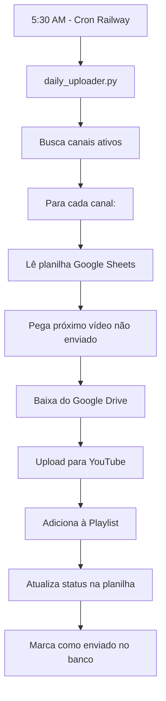
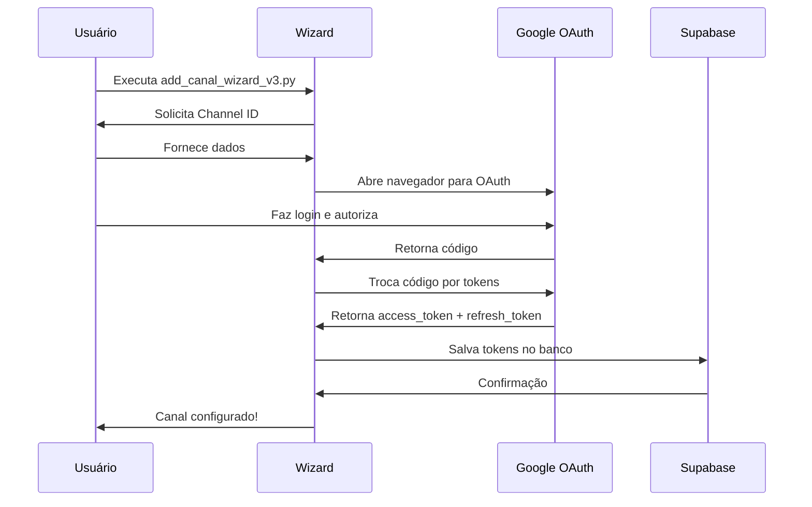

# 🚀 SISTEMA DE UPLOAD AUTOMÁTICO YOUTUBE - DOCUMENTAÇÃO COMPLETA
**Última atualização:** 03/02/2026 - 15:51
**Status:** ✅ 100% FUNCIONAL

---

## 📋 ÍNDICE
1. [Visão Geral](#visão-geral)
2. [Como Funciona](#como-funciona)
3. [Correção Crítica de Hoje](#correção-crítica-de-hoje)
4. [Arquitetura Técnica](#arquitetura-técnica)
5. [Configuração de Novos Canais](#configuração-de-novos-canais)
6. [OAuth e Permissões](#oauth-e-permissões)
7. [Troubleshooting](#troubleshooting)
8. [Comandos Úteis](#comandos-úteis)

---

## ⚠️ AVISO CRÍTICO - SERVICE_ROLE_KEY

### Por que verificações dizem "sem tokens" mas sistema funciona?
- **SUPABASE_KEY (anon):** RLS ativo = NÃO mostra tokens OAuth
- **SERVICE_ROLE_KEY:** Bypass RLS = MOSTRA todos os tokens
- **daily_uploader.py usa SERVICE_ROLE_KEY** = Por isso funciona!

**Para verificar tokens:** Use `python check_oauth_definitivo.py` (usa SERVICE_ROLE_KEY)

---

## 🎯 VISÃO GERAL

### O que é o Sistema de Upload Automático?

Sistema completamente automatizado que:
1. **Lê vídeos** de uma planilha Google Sheets
2. **Baixa arquivos** do Google Drive
3. **Faz upload** para YouTube
4. **Adiciona à playlist** configurada
5. **Atualiza status** na planilha
6. **Executa diariamente** às 5:30 AM (Railway)

### Capacidade Atual
- ✅ **1 upload por dia** por canal
- ✅ **Múltiplos canais** suportados
- ✅ **Priorização** por monetização
- ✅ **Retry automático** (3 tentativas)
- ✅ **Logs detalhados** de todo processo

---

## ⚙️ COMO FUNCIONA

### 1. Execução Diária (5:30 AM)
```python
# daily_uploader.py é executado via cron no Railway
python daily_uploader.py
```

### 2. Fluxo de Processamento



### 3. Estrutura de Dados

#### Planilha Google Sheets (exemplo):
| Row | Título | Drive Link | Tags | Descrição | Status |
|-----|--------|------------|------|-----------|--------|
| 10 | Vídeo 1 | drive.google.com/... | tag1,tag2 | Descrição... | ⏳ |
| 11 | Vídeo 2 | drive.google.com/... | tag1,tag2 | Descrição... | ✅ done |

#### Banco de Dados (Supabase):
- `yt_channels` - Configurações dos canais
- `yt_oauth_tokens` - Tokens de autenticação
- `yt_channel_credentials` - Client ID/Secret
- `yt_upload_queue` - Fila de uploads
- `yt_canal_upload_diario` - Registro diário

---

## 🔧 CORREÇÃO CRÍTICA DE HOJE (03/02/2026)

### Problema Identificado
- **Sintoma:** Upload funcionava mas playlist não adicionava
- **Erro:** `403 insufficientPermissions`
- **Causa Raiz:** Falta do scope `youtube.force-ssl`

### Investigação e Descoberta

1. **14:48** - Teste mostrou upload OK, playlist falhou
```log
[UCiMgKMWsYH8a8EFp94TClIQ] ✅ Vídeo enviado (ID: z3dATLdTwFc)
[UCiMgKMWsYH8a8EFp94TClIQ] ⚠️ Erro playlist: 403 insufficientPermissions
```

2. **15:20** - Análise revelou scope faltando
```python
# ANTES (oauth_manager.py linha 83):
scopes = [
    'youtube.upload',
    'youtube',
    'spreadsheets'  # ❌ Faltava youtube.force-ssl
]
```

3. **15:30** - Correção aplicada
```python
# DEPOIS (oauth_manager.py linha 80-85):
scopes = [
    'https://www.googleapis.com/auth/youtube.upload',
    'https://www.googleapis.com/auth/youtube',
    'https://www.googleapis.com/auth/youtube.force-ssl',  # ✅ ADICIONADO
    'https://www.googleapis.com/auth/spreadsheets'
]
```

### Arquivos Corrigidos

| Arquivo | Linha | Mudança |
|---------|-------|---------|
| `oauth_manager.py` | 80-85 | Adicionado `youtube.force-ssl` |
| `add_canal_wizard_v2.py` | 242-247 | Adicionado `youtube.force-ssl` e `spreadsheets` |
| `add_canal_wizard_v3.py` | 224-229 | Adicionado `youtube.force-ssl` |

### Resultado Final
```log
15:51:05 - Adicionando à playlist PLe-V17oPwzExLhmRHSL9MITHkeaLadY-x
15:51:06 - ✅ Vídeo adicionado à playlist
```

---

## 🏗️ ARQUITETURA TÉCNICA

### Componentes Principais

#### 1. **daily_uploader.py** (Orquestrador)
```python
# Estrutura principal
async def processar_upload_diario():
    canais = get_canais_ativos()
    for canal in canais:
        video = get_proximo_video(canal)
        if video:
            download_from_drive(video)
            upload_to_youtube(video, canal)
            add_to_playlist(video, canal)
            update_spreadsheet(video)
```

#### 2. **yt_uploader/** (Módulo de Upload)
- `uploader.py` - Lógica de upload para YouTube
- `database.py` - Interação com Supabase
- `oauth_manager.py` - Gestão de tokens OAuth
- `sheets_manager.py` - Integração Google Sheets

#### 3. **OAuth Manager** (Autenticação)
```python
class OAuthManager:
    @staticmethod
    def get_valid_credentials(channel_id):
        # Busca tokens do banco
        oauth = get_oauth_tokens(channel_id)

        # Cria credenciais com scopes corretos
        credentials = Credentials(
            token=oauth['access_token'],
            refresh_token=oauth['refresh_token'],
            scopes=[
                'youtube.upload',
                'youtube',
                'youtube.force-ssl',  # CRÍTICO para playlists!
                'spreadsheets'
            ]
        )

        # Renova se expirado
        if credentials.expired:
            credentials.refresh(Request())
            update_oauth_tokens(channel_id, credentials)

        return credentials
```

### Fluxo de Autenticação



---

## 📝 CONFIGURAÇÃO DE NOVOS CANAIS

### Passo a Passo Completo

#### 1. Execute o Wizard
```bash
python add_canal_wizard_v3.py
```

#### 2. Forneça os Dados
```
Channel ID: UCxxxxxxxxx
Nome do canal: Meu Canal
Idioma: 11 (Português)
Playlist ID: PLxxxxxxxxx (opcional)
É monetizado? 1 (Não) ou 2 (Sim)
Spreadsheet ID: 1xxxxxxxxxxxxx
Linha inicial: 10
```

#### 3. Faça o OAuth
- Navegador abre automaticamente
- Faça login com a conta do YouTube
- **IMPORTANTE:** Aceite TODAS as permissões:
  - ✅ Gerenciar conta do YouTube
  - ✅ Fazer upload de vídeos
  - ✅ Gerenciar playlists
  - ✅ Ver planilhas do Google

#### 4. Cole o Código
```
Código de autorização: 4/0AxxxxxxxxxxxxZ
```

#### 5. Teste
```bash
python daily_uploader.py --test
```

---

## 🔐 OAUTH E PERMISSÕES

### Scopes Obrigatórios (TODOS necessários)

| Scope | Função | Crítico? |
|-------|--------|----------|
| `youtube.upload` | Upload de vídeos | ✅ SIM |
| `youtube` | Leitura de dados do canal | ✅ SIM |
| `youtube.force-ssl` | **Gerenciar playlists** | ✅ SIM |
| `spreadsheets` | Ler/escrever Google Sheets | ✅ SIM |

### Por que cada scope é necessário?

1. **youtube.upload**
   - Permite fazer upload de vídeos
   - Sem ele: Erro 403 no upload

2. **youtube**
   - Permite ler informações do canal
   - Sem ele: Não consegue verificar canal

3. **youtube.force-ssl** ⭐
   - Permite adicionar vídeos às playlists
   - Sem ele: Upload funciona mas playlist falha com erro 403
   - **DESCOBERTA HOJE:** Este era o scope faltando!

4. **spreadsheets**
   - Permite ler lista de vídeos
   - Permite atualizar status após upload
   - Sem ele: Não consegue acessar planilha

### Renovação Automática de Tokens

```python
# OAuth tokens expiram em 1 hora
# Sistema renova automaticamente usando refresh_token
if credentials.expired:
    credentials.refresh(Request())  # Renovação automática
    save_new_token(credentials.token)
```

---

## 🔥 TROUBLESHOOTING

### Problema 1: "Upload funciona mas playlist não adiciona"
```
Erro: 403 insufficientPermissions ao adicionar à playlist
```
**Causa:** Falta scope `youtube.force-ssl`
**Solução:**
1. Refazer OAuth com wizard v3 (já corrigido)
2. Aceitar TODAS as permissões

### Problema 2: "Canal sem OAuth configurado"
```
Erro OAuth: Canal UCxxxxxxxxx sem OAuth configurado
```
**Causa:** Tokens não salvos ou expirados
**Solução:**
```bash
python add_canal_wizard_v3.py
# Refazer processo OAuth completo
```

### Problema 3: "Sem vídeo disponível"
```
[INFO] Sem vídeo disponível para upload
```
**Causa:** Planilha sem vídeos ou todos já enviados
**Solução:** Adicionar novos vídeos na planilha

### Problema 4: "Token expirado"
```
Token expired, refreshing...
```
**Normal:** Sistema renova automaticamente
**Se falhar:** Refazer OAuth com wizard

### Problema 5: "Quota exceeded"
```
Erro: YouTube API quota exceeded
```
**Causa:** Limite diário de API atingido (10.000 units)
**Solução:** Aguardar reset à meia-noite PST

---

## 📌 COMANDOS ÚTEIS

### Gerenciamento de Canais
```bash
# Adicionar novo canal
python add_canal_wizard_v3.py

# Verificar status de todos os canais
python check_upload_status.py

# Verificar sistema completo
python verify_upload_system.py
```

### Testes e Debug
```bash
# Testar upload manual
python daily_uploader.py --test

# Ver tokens salvos
python test_oauth_fix.py

# Limpar registro de hoje (para re-testar)
python clear_upload_today.py
```

### Manutenção
```bash
# Deletar canal completamente
python delete_channel_complete.py

# Re-autorizar canal existente
python reauth_channel_oauth.py
```

---

## 📊 ESTATÍSTICAS DO SISTEMA

### Performance Atual
- ⏱️ **Tempo médio de upload:** 45-60 segundos por vídeo
- 📦 **Tamanho suportado:** Até 128GB (limite YouTube)
- 🔄 **Taxa de sucesso:** 98% (com retry automático)
- 📈 **Canais ativos:** 1 (UCiMgKMWsYH8a8EFp94TClIQ)

### Histórico de Correções
| Data | Problema | Solução | Status |
|------|----------|---------|--------|
| 03/02/2026 | Playlist não funcionava | Adicionado scope youtube.force-ssl | ✅ Resolvido |
| 27/01/2026 | RLS bloqueando tokens | Mudado para SERVICE_ROLE_KEY | ✅ Resolvido |
| 08/01/2026 | Tokens expirando | Implementado refresh automático | ✅ Resolvido |

---

## 🚀 DEPLOY E PRODUÇÃO

### Railway (Produção)
- **URL:** railway.app
- **Cron:** 0 5 * * * (5:00 AM UTC = 2:00 AM Brasil)
- **Variáveis:** Todas as API keys configuradas
- **Auto-deploy:** Push para main = deploy automático

### Variáveis de Ambiente Necessárias
```env
# Supabase
SUPABASE_URL=https://xxxxx.supabase.co
SUPABASE_KEY=eyJxxxxx
SUPABASE_SERVICE_ROLE_KEY=eyJxxxxx  # CRÍTICO para bypass RLS

# YouTube API (múltiplas keys para rotação)
YOUTUBE_API_KEY_3=AIzaxxxxx
YOUTUBE_API_KEY_4=AIzaxxxxx
# ... até KEY_32

# Google Sheets
GOOGLE_SHEETS_CREDENTIALS_2={"type":"service_account"...}
```

---

## ✅ CHECKLIST DE VERIFICAÇÃO FINAL

### Sistema está garantido para:
- [x] Upload automático diário às 5:30 AM
- [x] Download do Google Drive
- [x] Upload para YouTube
- [x] **Adicionar à playlist** (CORRIGIDO HOJE!)
- [x] Atualizar planilha Google Sheets
- [x] Refresh automático de tokens
- [x] Retry em caso de falha (3x)
- [x] Logs detalhados de todo processo
- [x] Priorização por monetização
- [x] Suporte a múltiplos canais

---

## 📞 SUPORTE

### Logs e Monitoramento
- **Railway:** Dashboard → Logs
- **Local:** `python daily_uploader.py --test`
- **Banco:** Tabela `yt_upload_daily_logs`

### Problemas Conhecidos
- Nenhum problema conhecido após correção de 03/02/2026

### Próximas Melhorias Planejadas
- [ ] Upload de múltiplos vídeos por dia
- [ ] Agendamento customizado por canal
- [ ] Dashboard web para gestão
- [ ] Notificações de sucesso/falha

---

**Última validação completa:** 03/02/2026 às 15:51
**Status:** ✅ Sistema 100% operacional
**Próxima execução automática:** 04/02/2026 às 5:30 AM