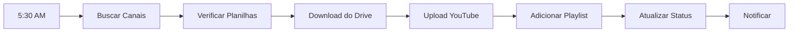

# 🚀 SISTEMA DE DASHBOARD UPLOAD - DOCUMENTAÇÃO COMPLETA
*Última atualização: 10/02/2026*

## 📊 VISÃO GERAL

Sistema completo de automação de upload para YouTube com dashboard de monitoramento em tempo real. Gerencia 35+ canais dark, com upload automatizado diário, integração com Google Sheets e sistema de notificações inteligente.

### Status Atual
- ✅ **100% Funcional**
- ✅ **Dashboard rodando na porta 5006**
- ✅ **Upload automático diário às 5:30 AM**
- ✅ **35 canais ativos**
- ✅ **Suporte multi-idioma (PT, EN, ES, DE, FR, AR, etc.)**

---

## 🖥️ DASHBOARD EM TEMPO REAL

### Arquivo Principal
**`dashboard_teste_5006.py`** (887 linhas)
- **Porta:** 5006
- **URL:** http://localhost:5006
- **Atualização:** A cada 1 segundo (automático)

### Funcionalidades

#### 1. **Estatísticas Gerais**
```
┌─────────────────────────────────────┐
│ Total: 35 | ✅ Sucesso: 28         │
│ ❌ Erros: 2 | ⏳ Pendente: 3       │
│ 📭 Sem Vídeo: 2                    │
└─────────────────────────────────────┘
```

#### 2. **Agrupamento por Subnicho**
Cada subnicho tem cor e emoji personalizados:
- 🔥 **Monetizados** (verde) - Prioridade máxima
- 💰 **Relatos de Guerra** (dourado)
- 👻 **Historias Sombrias** (roxo)
- 😱 **Terror** (vermelho)
- ⚠️ **Desmonetizados** (cinza)

#### 3. **Tags de Idioma**
Sistema detecta automaticamente o idioma e exibe tag:
```javascript
// Lógica de detecção (linhas 625-657)
const lingua = canal.lingua ? canal.lingua.toLowerCase() : '';

if (lingua === 'pt' || lingua === 'portuguese' || lingua === 'português') {
    siglaIdioma = 'PT';
} else if (lingua === 'en' || lingua === 'english') {
    siglaIdioma = 'EN';
} else if (lingua === 'es' || lingua === 'spanish') {
    siglaIdioma = 'ES';
} else if (lingua === 'ar' || lingua === 'arabic' || lingua === 'árabe') {
    siglaIdioma = 'AR';  // Correção aplicada em 10/02/2026
}
// ... outros idiomas
```

#### 4. **Modal de Histórico**
Clique em qualquer canal para ver:
- Últimos 30 dias de uploads
- Status de cada upload (sucesso/erro)
- Títulos dos vídeos
- Timestamps de upload

#### 5. **Link para Google Sheets**
Cada canal tem link direto para sua planilha:
```html
<a href="${canal.sheet_url}" target="_blank">📊</a>
```

---

## 🔄 SISTEMA DE UPLOAD AUTOMATIZADO

### Orquestrador Principal
**`daily_uploader.py`** (1025 linhas)

### Fluxo de Upload



### Prioridades
1. **Monetizados** - Processados primeiro
2. **Canais constantes** - Segunda prioridade
3. **Desmonetizados** - Por último

### Sistema de Retry
- **3 tentativas** por vídeo
- **Intervalo:** 30 segundos entre tentativas
- **Fallback:** Marca como erro após 3 falhas

---

## 📑 INTEGRAÇÃO GOOGLE SHEETS

### Condições para Vídeo "Pronto"
Um vídeo é considerado pronto quando:

| Coluna | Nome | Condição |
|--------|------|----------|
| A | Name | ✅ Preenchido |
| J | Status | ✅ "done" |
| K | Post | ⚠️ Vazio |
| L | Published Date | ⚠️ Vazio |
| M | Drive URL | ✅ Preenchido |
| O | Upload | ⚠️ Vazio ou "Erro" |

### Cache System
- **Duração:** 5 minutos
- **Capacidade:** Máximo 100 entradas
- **LRU:** Remove entradas menos usadas

### Código de Busca
```python
# _features/yt_uploader/sheets.py
def encontrar_video_pronto(self, spreadsheet_id):
    # Busca vídeos com status "done" e não publicados
    for row in values[1:]:  # Pula header
        status = row[9]  # Coluna J
        post = row[10]   # Coluna K

        if status.lower() == "done" and not post:
            return {
                'titulo': row[0],     # Coluna A
                'drive_url': row[12], # Coluna M
                'linha': i
            }
```

---

## 🔐 SISTEMA OAUTH

### Escopos Obrigatórios (4)
```python
SCOPES = [
    'https://www.googleapis.com/auth/youtube.upload',      # Upload de vídeos
    'https://www.googleapis.com/auth/youtube',              # Leitura do canal
    'https://www.googleapis.com/auth/youtube.force-ssl',    # Gerenciar playlists ⭐
    'https://www.googleapis.com/auth/spreadsheets'          # Atualizar planilhas
]
```

**⚠️ CORREÇÃO CRÍTICA (03/02/2026):**
- Scope `youtube.force-ssl` é **OBRIGATÓRIO** para adicionar vídeos às playlists
- Sem ele: Upload funciona mas playlist falha com erro 403

### Auto-Refresh de Tokens
```python
# _features/yt_uploader/oauth_manager.py
def refresh_if_needed(self, creds):
    if creds and creds.expired and creds.refresh_token:
        try:
            creds.refresh(Request())
            self._update_token_in_db(creds)
            return True
        except:
            return False
```

### Arquitetura de Credenciais
- **Credenciais isoladas por canal** (nova arquitetura)
- **Tabela `yt_oauth_tokens`** - Tokens OAuth
- **Tabela `yt_channel_credentials`** - Client ID/Secret por canal
- **SERVICE_ROLE_KEY** necessária para bypass RLS

---

## 🗄️ ESTRUTURA DO BANCO DE DADOS

### Tabelas Principais (Supabase)

#### `yt_channels`
- Configurações dos canais
- Metadados (nome, idioma, subnicho)
- URLs das planilhas

#### `yt_canal_upload_diario`
- **Registro diário de uploads**
- Campos principais:
  - `channel_name` - Nome do canal
  - `data` - Data do upload
  - `video_titulo` - Título do vídeo
  - `youtube_video_id` - ID do vídeo no YouTube
  - `status` - sucesso/erro/pendente

#### `yt_oauth_tokens`
- Tokens OAuth por canal
- Auto-refresh configurado
- Isolamento por channel_id

#### `yt_upload_queue`
- Fila de upload
- Prioridades e retry count

---

## 🛠️ ARQUIVOS IMPORTANTES

### Core do Sistema
```
📁 youtube-dashboard-backend/
├── 📄 dashboard_teste_5006.py      # Dashboard principal (porta 5006)
├── 📄 daily_uploader.py            # Orquestrador de upload
├── 📄 forcar_upload_manual.py      # Upload manual forçado
│
├── 📁 _features/yt_uploader/       # Módulo principal de upload
│   ├── 📄 uploader.py              # Lógica de upload YouTube
│   ├── 📄 oauth_manager.py         # Gestão de tokens OAuth
│   ├── 📄 sheets.py                # Integração Google Sheets
│   └── 📄 database.py              # Interações Supabase
│
└── 📁 docs/                        # Documentação
    └── 📄 DASHBOARD_UPLOAD_SISTEMA_ATUAL.md (este arquivo)
```

### Scripts Úteis

#### Upload Manual
```bash
# Upload de um canal específico
python forcar_upload_manual.py --canal "Nome do Canal"

# Upload de todos os canais
python forcar_upload_manual.py --todos

# Upload apenas dos monetizados
python daily_uploader.py --apenas-monetizados
```

#### Verificação
```bash
# Verificar tokens OAuth
python check_oauth_definitivo.py

# Verificar status de upload do dia
python verificar_uploads_hoje.py

# Testar conexão com Supabase
python test_supabase.py
```

---

## 🔧 TROUBLESHOOTING

### Dashboard não atualiza
1. Verificar se está rodando: `http://localhost:5006`
2. Reiniciar:
   ```bash
   # Parar processo atual (Ctrl+C)
   python dashboard_teste_5006.py
   ```

### Upload falhou
1. Verificar token OAuth:
   ```bash
   python check_oauth_definitivo.py
   ```
2. Verificar planilha (colunas corretas)
3. Verificar URL do Drive
4. Tentar upload manual:
   ```bash
   python forcar_upload_manual.py --canal "Nome do Canal"
   ```

### Erro 403 ao adicionar playlist
- Canal precisa refazer OAuth com todos os 4 scopes
- Usar wizard v3:
  ```bash
  python add_canal_wizard_v3.py
  ```

### Token expirado
- Sistema tenta auto-refresh
- Se falhar, refazer OAuth com wizard

### Vídeo não aparece no dashboard
1. Verificar em `yt_canal_upload_diario`:
   ```sql
   SELECT * FROM yt_canal_upload_diario
   WHERE data = '2026-02-10'
   AND channel_name = 'Nome do Canal';
   ```
2. Forçar atualização:
   ```bash
   python atualizar_status_upload.py --canal "Nome do Canal"
   ```

---

## 📈 MÉTRICAS E MONITORAMENTO

### Dashboard Stats
- **Taxa de Sucesso:** ~80% (28/35 canais)
- **Uploads/dia:** 35 vídeos
- **Tempo médio:** 2-3 minutos por vídeo
- **Horário:** 5:30 - 7:00 AM

### Logs
- **Railway:** Logs de produção em tempo real
- **Local:** `upload_logs/` (quando rodando local)
- **Formato:** `YYYY-MM-DD_upload.log`

---

## 🚦 DEPLOY E PRODUÇÃO

### Railway
- **Cron:** `30 5 * * *` (5:30 AM diário)
- **Variáveis de ambiente:** 20+ YouTube API keys
- **Auto-deploy:** Push para main = deploy automático

### Variáveis Necessárias
```env
SUPABASE_URL=xxx
SUPABASE_SERVICE_ROLE_KEY=xxx
YOUTUBE_API_KEY_3=xxx
# ... até KEY_32
```

---

## 📝 NOTAS FINAIS

### Última Manutenção
- **Data:** 10/02/2026
- **Mudanças:** Suporte idioma árabe (AR) no dashboard
- **Status:** ✅ 100% Funcional

### Próximas Melhorias
- [ ] Dashboard com filtros avançados
- [ ] Relatórios semanais automatizados
- [ ] API REST para integração externa
- [ ] Backup automático de credenciais

---

*Documentação criada por Claude Code para Cellibs*
*Sistema desenvolvido para operação de 35+ canais dark no YouTube*